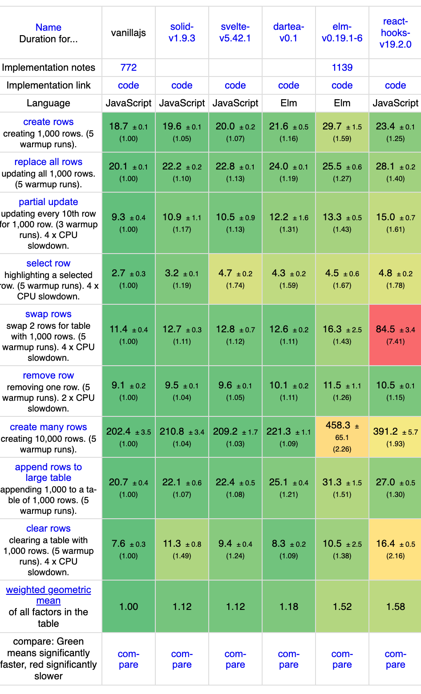

# dartea

dartea is a compiler for the Elm language. It is written in OCaml. It takes Elm code and produces modern JavaScript.

The language is the same Elm. Same syntax, same types, same error messages, same Html library. The difference starts after the type checker.

## Modern JavaScript

The output is JavaScript as people write it today. ES modules. `const` and arrow functions. `async` and `await`. `fetch` and `AbortSignal`. One `.mjs` file per Elm module.

Dead code is removed across modules. A counter app compiles to about 2 KB.

If you need old browsers, run the output through any bundler with a target. There is nothing unusual in it.

## No virtual DOM

dartea owns the Html library, the compiler and the runtime. So the compiler can see the shape of a `view` function.

The static part of a view becomes a DOM template. It is created once and cloned. The dynamic parts become holes with direct links to DOM nodes. On update the runtime looks at the values in the holes and writes only the ones that changed. There is no tree diff.

Elm values never change in place. So "did this value change" is one reference check. You get fine grained updates with no reactive runtime and no new syntax. `Html.Lazy` still works. You do not need it anymore.

## Speed

We run js-framework-benchmark. The script `bench/run.sh` clones it, adds dartea as one more framework and starts the official runner. The other frameworks are the official implementations from that repository. Only the dartea program is ours.

Result. Weighted geometric mean of slowdowns: vanilla 1.00, Solid 1.12, Svelte 1.12, dartea 1.18, Elm 1.52, React 1.58.

Screenshot of the result page from that run. Apple M5, headless Chrome, August 30, 2026. This is my machine, not the official published table.



## Effects

`Task` is an `async` function. It gets an `AbortSignal`. `Http` is `fetch` with a timeout signal. `Cmd.batch` starts all commands at once and delivers the messages in order. The Elm architecture stays as it is. Ports and subscriptions work as before.

## Status

The upstream TodoMVC runs without changes. A parity test checks module by module against Elm.

Ready: `elm/core`, `elm/html`, `elm/browser` with `sandbox`, `element`, `document` and `application`, `elm/url`, `elm/json`, `elm/http` without Bytes and File, part of `elm/time`.

Missing: `Random`, `Process`, `Set`, `Array`, packages from the Elm registry.

## Use

```
dartea make src/Main.elm --output index.html
dartea make src/Main.elm --output app.js
dartea make src
```

The first makes a page with the script inside. The second makes a script. The third makes one `.mjs` per module.

To build from source you need OCaml 5.4. Run `dune build` and `dune test`.

## Licence

BSD 3-Clause.

dartea is an independent project. It is not part of the Elm project and Elm does not endorse it.

Some standard library modules come from elm/core, elm/html, elm/browser, elm/url and elm/http by Evan Czaplicki. `LICENSE` lists every such file. Compiled output includes `dartea.LICENSE.txt` only when one of those modules is in it.
